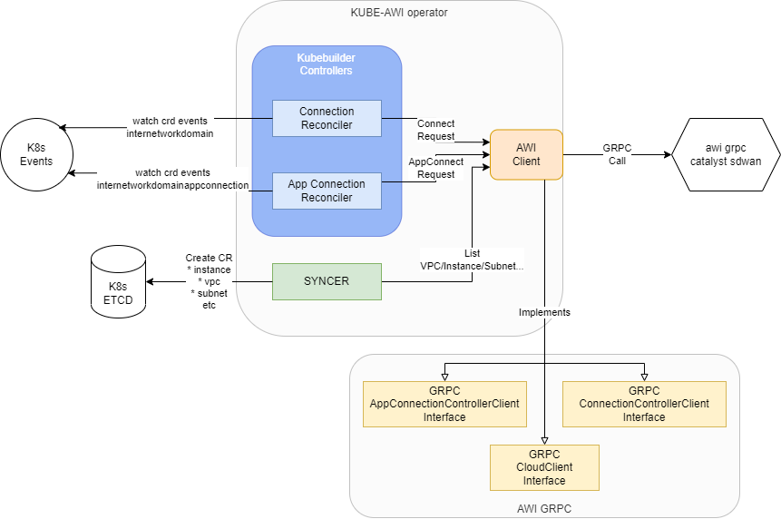

# kube-awi
Cisco k8s operator and controller implementation for Application WAN Interface (AWI)

The kube-awi allows using k8s custom resources to interact with AWI project.

## Overview

With kube-awi installed on the k8s cluster, the following actions can be done:

* creating requests to awi with `kubectl apply`
* getting information about instances, network domains etc. with `kubectl get`

Installation of kube-awi on the k8s cluster involves creating Custom Resource
Definitions, namely:

* instances.awi.app-net-interface.io
* internetworkdomainappconnections.awi.app-net-interface.io
* internetworkdomains.awi.app-net-interface.io
* networkdomains.awi.app-net-interface.io
* sites.awi.app-net-interface.io
* subnets.awi.app-net-interface.io
* vpcs.awi.app-net-interface.io
* vpns.awi.app-net-interface.io

They can be grouped into two use cases

1. Interacting with the awi

    Resources `internetworkdomains` and `internetworkdomainappconnections` are
    a way of creating requests to AWI system.

    For instance, applying the following `internetworkdomain.yaml` manifest

    ```yaml
    apiVersion: awi.app-net-interface.io/v1alpha1
    kind: InterNetworkDomain
    metadata:
    name: my-internetworkdomain
    spec:
    metadata:
        name: example-name
    spec:
        destination:
            metadata:
                name: machine-learning-training
                description: "Description of the destination"
            networkDomain:
                selector:
                matchId:
                    id: vpc-097e8ed349c13c004
        source:
            metadata:
                name: machine-learning-dataset
                description: "Description of the source"
            networkDomain:
                selector:
                matchId:
                    id: vpc-04a1eaad3aa81310f
    ```

    will create a request to create Network Domain Connection
    between Source VPC `vpc-097e8ed349c13c004` and Destination
    VPC ` vpc-04a1eaad3aa81310f`.

1. Checking existing VPCs, Instances, Subnets etc.

    Resources `instance`, `network_domain`, `site`, `subnet`, `vpc`
    and `vpn` represent resources that can be inspected using either
    AWI UI or AWI CLI.

    To check the list of instances, simply run

    ```
    // Get all instances
    kubectl get instance -A 
    ```

    and the kubectl will return a list of obtained instances from
    supported providers (AWS and GCP) just like getting list of
    `pods`, `deployments` etc.

    To get details of a certain instance run

    ```
    kubectl get instance INSTANCE_ID -n awi-system -o yaml
    ```

    to see the details of the resource.

## Under the hood

Both use cases described above are available thanks to the k8s
operator.



Installation of the kube-awi on the k8s creates a special deployment
called `kube-awi-controller-manager` (kube-awi operator in the graph) which acts as a special process
that will:

* watch for updates of `internetworkdomains` and
    `internetworkdomainappconnections` custom resources and triggers
    actions defined in `controllers/RESOUCE_controller.go`

* synchronizes other resources by periodically obtaining lists of
    subnets, instances etc. from `awi-grpc-catalyst-sdwan` and
    creating custom resources inside the cluster

The Kube-AWI operator consists of so called controllers, that define
methods to be triggered for certain events, syncer which is a simple
goroutine and awi client which implements necessary interfaces and
specifies an address of the actual server from which the information
will be received and where connection requests will be forwarded.

The Kube-AWI operator also includes standard k8s operator manager
responsible for health checks and other useful resources.

### Controllers

Watching for updates and triggering certain actions is accomplished
with so called controllers. To generate a controller go to
[Adding new object](#adding-new-object).

A Controller specifies `Reconcile` method will is triggered whenever
there is an update of the certain Custom Resource. This method will
be called whenever a resource is created/updated/deleted.

Currently, kube-awi defines both resources in the following manner:

* removing Custom Resource using `kubectl delete` triggers deletion
    of VPC Connection or App Connection

* other events trigger Connection Creation attempt.

#### K8s data

Custom Resources specify two important sections:

1. Spec - the desired configuration for a resource

    Spec section is a user's input space. It accepts information about
    desired settings and the Reconciler's job is to attempt accomplishing
    them.

1. Status - the actual state of the object

    Status is a read-only information for the user about actual state of
    the resource. While state specifies the desired state, which may not
    be accomplished yet, impossible to accomplish or be a high-level
    definition of certain settings, the status section is updated by the
    reconciler and it is supposed to provide information about the present
    state and underlying low-level information that may be necessary for
    the user.

Currently, we do not make much use of the status field, but it could be
used for storing information about whether connection succeeded or not,
what was the error etc.

### Synchronizers

Kube-awi operator runs a syncing goroutine which periodically calls
awi-grpc-catalyst-sdwan to obtain resources from the AWI. Later, it
creates or updates Custom Resources associated with these resources.

Since these are read-only resources, they have no Controllers assigned
to them, as the operator does not care about user's changes there.

Since these resources are updated by the periodic sync operation, they
are eventually consistent.

## Development

The kube-awi uses kubebuilder framework for automatic creation of:
* Custom Resource Definitions
* Operator's code for UPDATE actions

The input for both is a go file `api/GROUP/VERSION/NAME_types.go`.

It specifies the structure of the resource and relevant fields.
The resouce can be marked with additional kubebuilder options to
customize the structure and its interactions (for example additional
columns present when running `kubectl get instances -A`)

### Adding new object

To create a new kind such as `instance` or `network_domain`, run kubebuilder
command to initiate a new object

```
kubebuilder create api --group awi --version v1alpha1 --kind <NewObjectName>
```

This will generate a new file in the directory `api/awi/v1alpha1/KIND_types.go`
with placeholder golang structures for both structure itself and a list
wrapper.

The CLI will ask if it should generate a controller for the resource. Replying
`yes` will add a note in the `PROJECT` file `controller: true`. This can be
changed manually later on.

To generate CRDs and operator code follow steps below.

### Updating object

To generate WebhookConfiguration, ClusterRole and CustomResourceDefinition objects run

```
make manifests
```

To generate code containing DeepCopy, DeepCopyInto, and DeepCopyObject method implementations:

```
make generate
```

Make sure to use up-to-date version of awi-grpc repository.

### Installing objects
Run:
- `make install` to install CRDs into the K8s cluster specified in ~/.kube/config.

### Running controller
Run:
- `make docker-build` to build controller image,
- (if you use kind cluster) change image pull policy for `app-net-interface.io/awi-controller:<TAG>` image to
`imagePullPolicy: IfNotPresent` to avoid pulling issues (TODO: automate this), required one time only,
- (if you use kind cluster) `CLUSTER_NAME=<your-cluster-name> make kind-load`,
- (if you use remote cluster) `make docker-push`,
- `make deploy` to update image in cluster controller deployment.

## Extending Kube-AWI

Currently, the kube-awi project gathers the entire logic in the
`main.go` file which is an entry point for the k8s operator. This
file instantiates k8s operator manager, initializes kube awi client,
registers existing reconcilers and runs syncing goroutine.

To make kube-awi more opened for other possible controllers, the
main file requires some design decisions over how different
controllers should be implemented.

1. The kube-awi embeds all 3 GRPC interfaces (connection, app connection and cloud clients)
    into single client with a configurable address. It means that current implementation
    prevents user from specifying a different address for cloud interface responsible for
    obtaining information about existing subnets etc. and for connection/app connection
    clients.

    It means that a new controller need to implement the entire logic - if we want to
    write a new controller which defines new logic for connections or app connections
    but we want to remain cloud connectivity from old controller, we would have to
    make our new controller forward cloud requests to the old one.

1. Connection and App Connection interfaces are explicitely loaded in the `main.go`
    file. If a new controller requires a different reconciling action, a new provider
    should be specified. Considering a scenario where all controller versions are
    specified inside kube-awi repository, the `main.go` file should be changed to
    dynamically load desired controllers based on the provided configuration.

1. Syncer goroutine is quite specific to awi project and the user may wish to use
    different implementation, use different CRDs for that or to not use syncer at
    all. This topic leads to a further design discussion around making kube-awi
    a library.

The project graph above shows the existing dependencies and potential points of
providing an abstraction over pieces of code that can be turned into customizable
modules.

## Running with minikube

Here is the instruction how to test Kube AWI with locally created
cluster with Minikube.

Create minikube cluster
```
minikube start
```

Create `awi-system` namespace.
```
kubectl create ns awi-system
```

To avoid pushing images to registries, simply set docker registry
context to use minikube's one:
```
eval $(minikube docker-env)
```

Now you can build images directly to minikube docker registry:
```
docker build --build-arg SSH_PRIVATE_KEY="$(cat PRIVATE_SSH_PATH)" -t IMAGE_NAME:IMAGE_TAG .
```

Replace PRIVATE_SSH_PATH, IMAGE_NAME and IMAGE_TAG with your values.

The private SSH key is necessary only for internal github access.
After opensourcing the project, the Dockerfile will be adjusted properly
and no private key will be longer needed.
The Dockerfile uses 2 stages for creating the image, the final stage
doesn't use the private SSH key so there is no need to worry about
exposing your private SSH key.

Now generate CRDs and deploy Kube AWI:
```
IMG=IMAGE_NAME:IMAGE_TAG make install
IMG=IMAGE_NAME:IMAGE_TAG make deploy
```

Again, replace IMAGE_NAME and IMAGE_TAG with your own values.

This should create CRDs and Manager pod in the cluster:

```
> kubectl get crds -A
---
NAME                                             CREATED AT
instances.awi.app-net-interface.io                          2024-02-09T04:09:55Z
internetworkdomainappconnections.awi.app-net-interface.io   2024-02-09T04:09:55Z
internetworkdomains.awi.app-net-interface.io                2024-02-09T04:09:55Z
networkdomains.awi.app-net-interface.io                     2024-02-09T04:09:55Z
sites.awi.app-net-interface.io                              2024-02-09T04:09:55Z
subnets.awi.app-net-interface.io                            2024-02-09T04:09:55Z
vpcs.awi.app-net-interface.io                               2024-02-09T04:09:55Z
vpns.awi.app-net-interface.io                               2024-02-09T04:09:55Z
```

```
> kubectl get pods -A
---
NAMESPACE     NAME                                          READY   STATUS    RESTARTS      AGE
awi-system    kube-awi-controller-manager-9d4697db6-h9qmn   2/2     Running   0             24m
kube-system   coredns-5dd5756b68-kz7zq                      1/1     Running   0             20h
kube-system   etcd-minikube                                 1/1     Running   0             20h
kube-system   kube-apiserver-minikube                       1/1     Running   0             20h
kube-system   kube-controller-manager-minikube              1/1     Running   0             20h
kube-system   kube-proxy-l6z4w                              1/1     Running   0             20h
kube-system   kube-scheduler-minikube                       1/1     Running   0             20h
kube-system   storage-provisioner                           1/1     Running   1 (20h ago)   20h
```

In order to make `kube-awi-controller-manager` working you need to modify the deployent:

```
kubectl edit deployment  kube-awi-controller-manager -n awi-system
```

Locate args and add `--awi-catalyst-address` pointing at the local process
of awi-grpc-catalyst-sdwan

```
- args:
    - --health-probe-bind-address=:8081
    - --metrics-bind-address=127.0.0.1:8080
    - --awi-catalyst-address=host.minikube.internal:50051
    - --leader-elect
```

The `host.minikube.internal` address points to your host machine.
The AWI GRPC Catalyst SDWAN needs to be started on `0.0.0.0` rather
than `127.0.0.1` - otherwise it won't work.

If, for some reason, this won't be able to reach your host address
(you will know that by the fact that manager logs will show only one
entry: `connecting`), try running `minikube tunnel` in different
terminal.

After doing so, the pod should be restarted and initialized successfully,
which you can inspect by seeing `2/2` containers in `get pods` command and
by seeing normal logs of your manager.

To create a connection, you can try running:

```
kubectl apply -f config/samples/awi_v1_internetworkdomain_vpc_to_vpc.yaml
```

Of course, the file needs to be modified to match your desired VPCs.

You can now see created connection:
```
> kubectl get internetworkdomains
---
NAME                    AGE
my-internetworkdomain   42s
```

This connection will most likely exist even if the actual connection was not created.
Check your AWI GRPC Catalyst SDWAN logs to see how the creation went.

To destroy the connection, simply remove the CR:
```
kubectl delete internetworkdomains my-internetworkdomain
```

That's it :)

To create sample app connection, you can use the following file:
```
kubectl apply -f examples/gcp-vpc-vpc-label-app-connection.yaml
```

After your minikube cluster is no longer needed, you can remove it by running:
```
minikube delete
```

## Contributing

Thank you for interest in contributing! Please refer to our
[contributing guide](CONTRIBUTING.md).

## License

kube-awi is released under the Apache 2.0 license. See
[LICENSE](./LICENSE).

kube-awi is also made possible thanks to
[third party open source projects](NOTICE).
